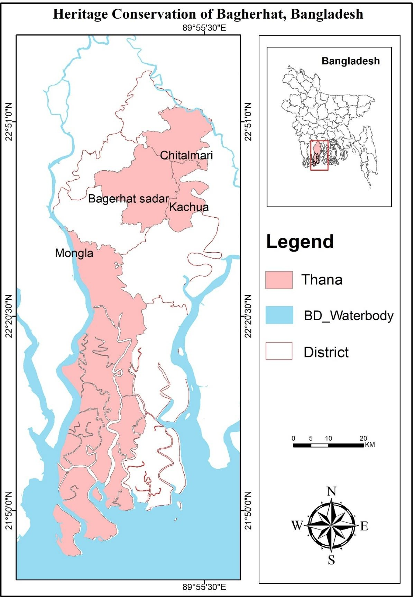
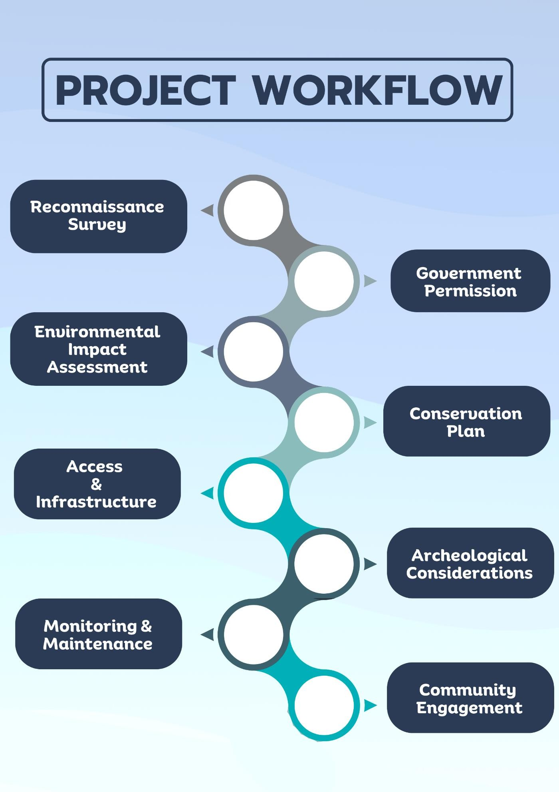
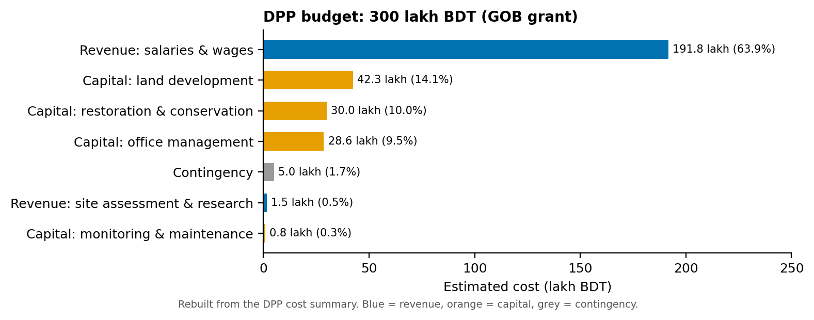
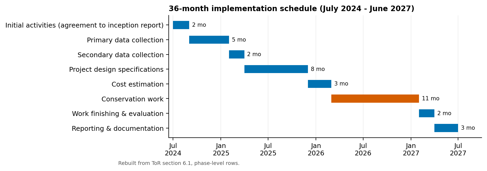

# Heritage Conservation Master Plan for Bagerhat: Development Project Proposal (DPP) and Terms of Reference (ToR)

**URP 4162 and URP 4262 Project Planning Studio, Dept. of Urban and Regional Planning, KUET** · 
## Summary

Bagerhat, the "City of Mosques" founded by Khan Jahan Ali in the 15th century, includes the UNESCO-listed Sixty Dome Mosque. Its heritage sites lack conservation planning, waste management and visitor facilities. Over two studio courses, our team prepared the two documents a Bangladesh government project needs:

1. A **Development Project Proposal (DPP)** in the Planning Commission format. It sets out objectives, a log frame, staffing, a 3-year financing plan and a **BDT 300 lakh** cost estimate, split across four thanas: Bagerhat Sadar, Kachua, Mongla and Chitalmari.
2. A **Terms of Reference (ToR)** for the consulting firm. It covers scope, a **36-month** work plan (July 2024 – June 2027), key personnel and man-months, qualifications, task descriptions and firm capabilities.



## Study area

Bagerhat District, Khulna Division: the historic Mosque City of Bagerhat and project areas in Bagerhat Sadar, Kachua, Mongla and Chitalmari.

## What the documents contain

| DPP (April 2024) | ToR (2024) |
|---|---|
| Sponsoring ministry: Ministry of Cultural Affairs; implementing agency: KDA | Background, objectives and scope of the heritage master plan |
| Objectives: historical documentation and assessment of heritage sites; a conservation and management strategy | Planning area and cost by thana |
| Financing: BDT 300 lakh GOB grant (150 / 80 / 70 lakh over FY2024-25 to FY2026-27) | 8-phase, 36-month work plan and manning schedules |
| Cost by component and by location; log frame; management setup; year-wise targets | Key personnel (e.g. team leader, town planner, archaeologist, conservation architect) with man-months and qualifications |
| Implementation arrangement: site assessment, access roads, restoration, utilities, monitoring | Specific tasks per expert, responsibility matrix, firm capabilities |



## Key figures

- **Budget (DPP):** salaries and wages 191.8 lakh (63.9%), land development and utilities 42.3 lakh, restoration materials 30.0 lakh, office management 28.6 lakh, contingencies 5.0 lakh.
- **By location:** Chitalmari 90, Bagerhat Sadar 80, Kachua 72 and Mongla 58 lakh BDT.
- **Schedule (ToR):** 2 months initiation → 5 months primary surveys (architectural, historical, condition, significance, threats) → 2 months secondary data → 8 months design → 3 months costing → 11 months conservation works → 2 months evaluation → 3 months reporting.





## Tools

Microsoft Word and Excel (DPP/ToR formats, costing, Gantt) · GIS (study-area map) · Python/matplotlib (redrawn charts in [`viz/`](viz/))

## Repository contents

```
images/   study-area map and workflow graphic (unchanged) + redrawn charts
viz/      make_figures.py and data/*.csv (DPP cost table, ToR phase schedule)
```

## Contact

Chinmoy Ghosh Shuvo · Open to collaboration and knowledge sharing. Feel free to reach out on [LinkedIn](https://www.linkedin.com/in/chinmoyghosh034).
